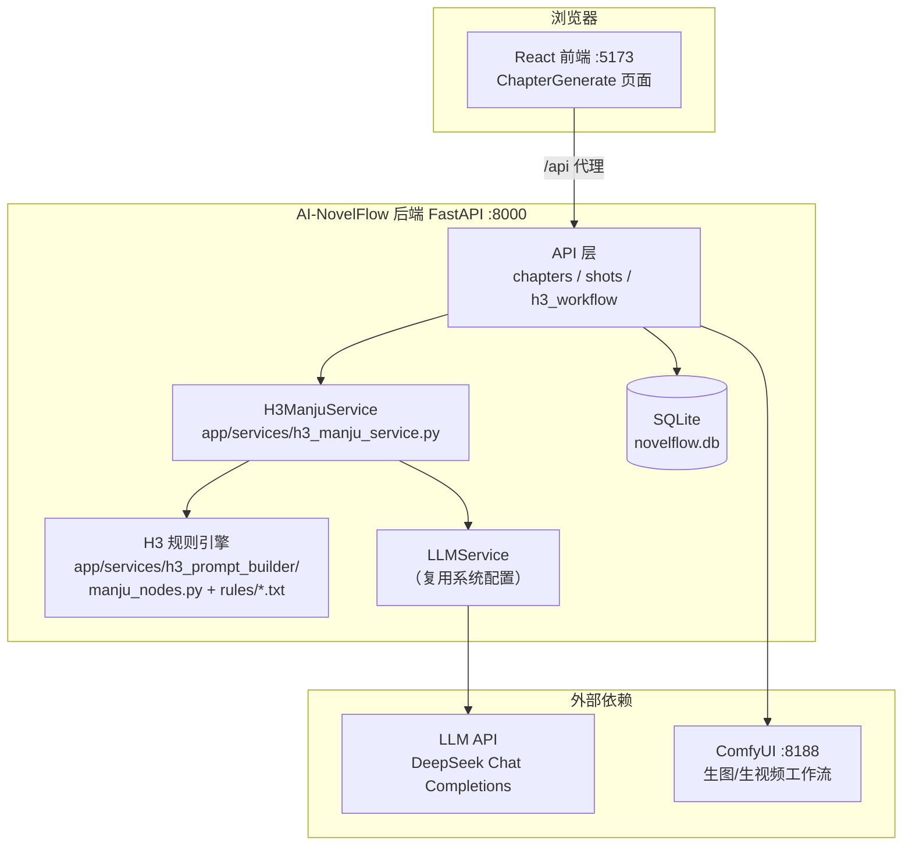
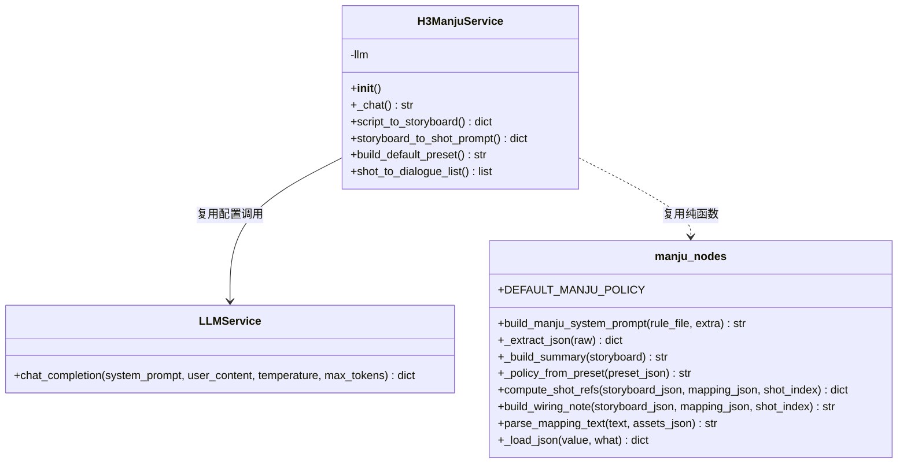
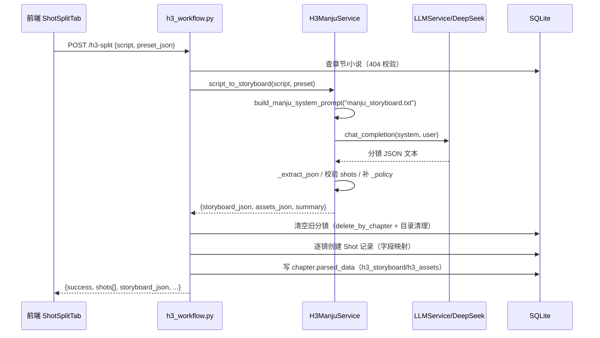
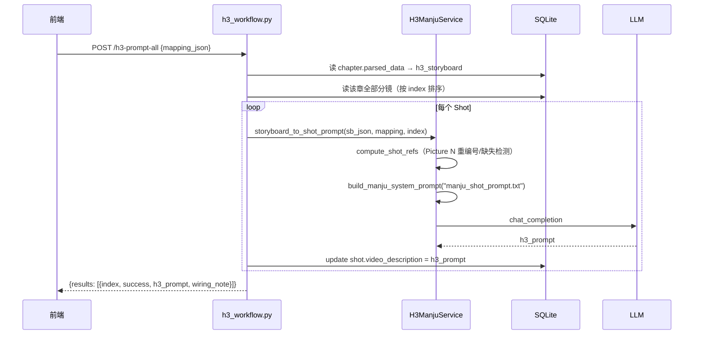
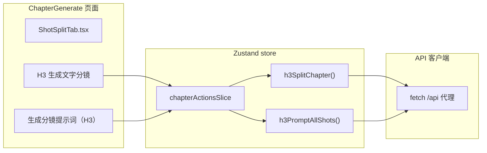
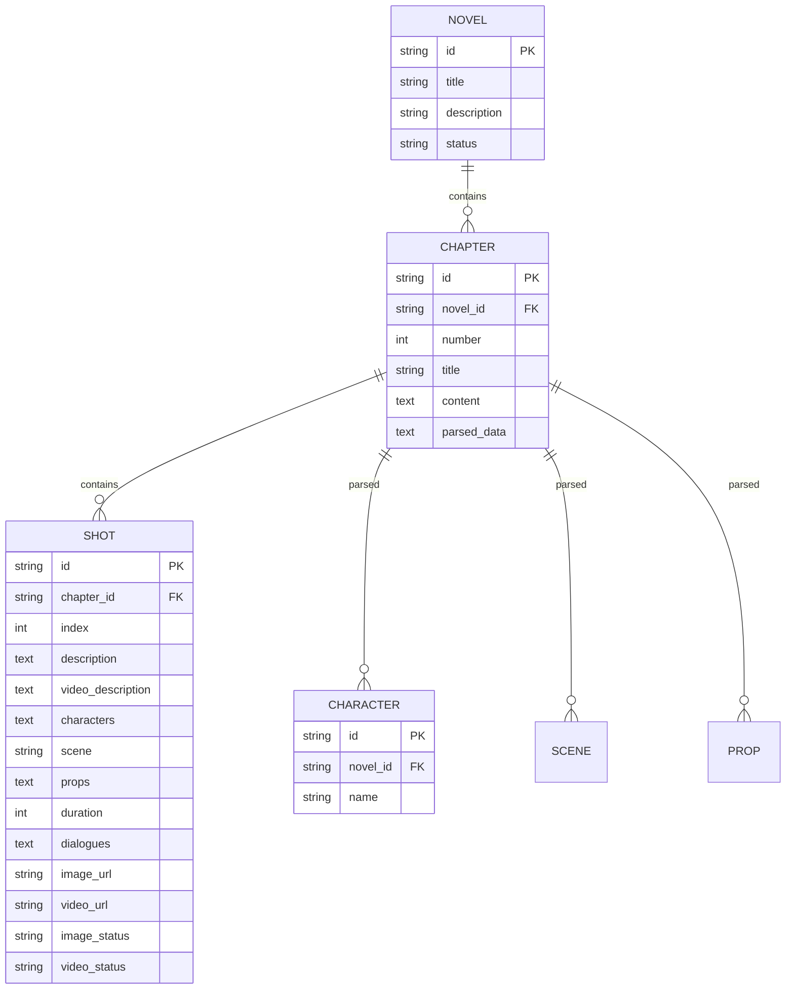
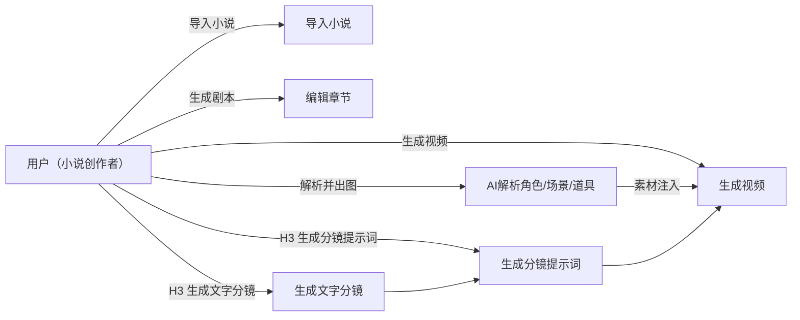
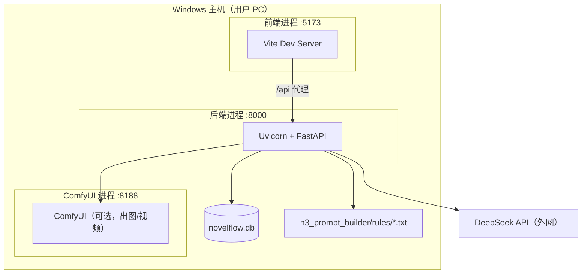

# AI-NovelFlow × H3 漫剧工作流集成 — 软件开发文档

> 版本：v1.0 ｜ 日期：2026-09-17 ｜ 状态：已部署验证
> 项目根目录：`D:\AIGC\develop\New_AI_Production_Workflow`
> 关联文档：`01_开发记录.md`（过程）、`02_代码变更清单.md`（代码级 diff）、`03_UML图集.md`（图集）、`../H3漫剧工作流集成说明.md`（部署运维）

---

## 目录

1. [项目概述](#1-项目概述)
2. [需求分析](#2-需求分析)
3. [总体架构设计](#3-总体架构设计)
4. [设计理念](#4-设计理念)
5. [后端设计](#5-后端设计)
6. [前端设计](#6-前端设计)
7. [规则引擎设计](#7-规则引擎设计)
8. [数据设计](#8-数据设计)
9. [UML 设计视图](#9-uml-设计视图)
10. [接口契约](#10-接口契约)
11. [部署与运维](#11-部署与运维)
12. [验证记录](#12-验证记录)
13. [已知限制与后续工作](#13-已知限制与后续工作)

---

## 1. 项目概述

### 1.1 背景

用户已具备两个独立项目：

| 项目 | 作用 | 原始路径 |
|---|---|---|
| **AI-NovelFlow** | AI 驱动的小说转动画/视频工作流平台（FastAPI + React），已成功部署运行 | `D:\AIGC\AI_NovelFlow\AI-NovelFlow` |
| **ComfyUI-H3-Prompt-Builder** | MiniMax H3 视频提示词构建 ComfyUI 插件，含"剧本→分镜剧本→逐镜 H3 提示词"漫剧流水线 | `D:\AIGC\develop\ComfyUI-H3-Prompt-Builder` |

用户要求：在备份副本基础上，将 H3 插件的漫剧分镜能力集成进 AI-NovelFlow，**替换**原有"编辑章节→生成文字分镜→生成分镜提示词"链路，形成符合目标工作流结构（`小说转视频工作流.html`）的独立工作流，并最终可本地启动访问、实现具体功能。

### 1.2 目标工作流结构（来自用户上传 HTML）

```
主流程（6 步，单向推进）：
  导入小说 → 生成剧本 → 编辑章节 → 生成文字分镜 → 生成分镜提示词 → 生成视频

并行执行区间（与主流程「生成剧本→生成分镜提示词」同步）：
  AI解析角色 ─→ 生成角色图 ─┐
  AI解析场景 ─→ 生成场景图 ─┼─→ 角色/场景/道具素材注入 ──→ 生成视频（虚线汇入）
  AI解析道具 ─→ 生成道具图 ─┘
```

### 1.3 技术栈

| 层 | 技术 |
|---|---|
| 后端 | Python 3.12、FastAPI 0.109、SQLAlchemy 2.0（SQLite）、Uvicorn |
| 前端 | React 18、TypeScript、Vite 5、Zustand、Tailwind |
| 外部依赖 | LLM（OpenAI 兼容 Chat Completions，默认 DeepSeek）、ComfyUI API（127.0.0.1:8188） |
| 规则引擎 | H3 漫剧规则库（manju_storyboard.txt / manju_shot_prompt.txt 等，纯文本提示词模板） |

### 1.4 交付边界

- **不改动原仓库**：全部修改在 `New_AI_Production_Workflow` 副本内完成
- **替换语义**：H3 链路作为"生成文字分镜 / 生成分镜提示词"的新实现；原"AI 拆分"保留但降级为可选项
- **验收口径**：文字链路（分镜/提示词）可独立验收；出图/出视频依赖 ComfyUI + 硬件（当前 GTX 1050 Ti 无法跑 MiniMax-H3，需换 RTX 30 系+）

---

## 2. 需求分析

### 2.1 功能需求（FR）

| 编号 | 需求 | 实现 |
|---|---|---|
| FR-1 | 导入小说 | 复用 AI-NovelFlow 小说管理 |
| FR-2 | 生成剧本 | 复用章节管理（章节即剧本） |
| FR-3 | 编辑章节 | 复用章节详情编辑 |
| FR-4 | 生成文字分镜（H3） | **新增** `POST /h3-split`，H3 漫剧规则生成分镜并落库 |
| FR-5 | 生成分镜提示词（H3） | **新增** `POST /h3-prompt-all` / `/h3-prompt`，逐镜 H3 提示词 |
| FR-6 | 生成视频 | 复用视频生成 Tab（H3 提示词格式兼容） |
| FR-7 | 角色/场景/道具解析与出图 | 复用现有 parse-* 接口与生图工作流 |
| FR-8 | 本地启动访问 | 后端 :8000 + 前端 :5173 双服务 |
| FR-9 | 资源映射辅助 | **新增** `POST /h3-mapping`，解析"角色A=图1" |

### 2.2 非功能需求（NFR）

| 编号 | 需求 | 说明 |
|---|---|---|
| NFR-1 | 非侵入式集成 | 不破坏原功能；新增模块独立成包 |
| NFR-2 | 配置复用 | LLM 调用复用 AI-NovelFlow 系统设置，避免重复配置 |
| NFR-3 | 数据兼容 | 分镜落库到现有 `shots` 表，字段映射可逆 |
| NFR-4 | 可验证 | 每个 API 可独立测试；前端按钮 → 代理 → 后端全链路可观测 |

### 2.3 边界与假设

- 假设用户已在系统设置配置 LLM 供应商（数据库已有 DeepSeek 配置，api_key 需用户填写）
- 分镜对话（H3 单字段 dialogue）映射为 AI-NovelFlow `dialogues` 数组格式
- H3 分镜 JSON 存入 `chapters.parsed_data`（不新增表、不迁移数据库）

---

## 3. 总体架构设计

### 3.1 系统架构



### 3.2 分层职责

| 层 | 职责 | 关键文件 |
|---|---|---|
| 路由层 | HTTP 入口、参数校验、依赖注入 | `app/api/h3_workflow.py` |
| 服务层 | 业务编排、LLM 调用、错误处理 | `app/services/h3_manju_service.py` |
| 规则引擎层 | 提示词组装、JSON 解析/规整、资源映射 | `app/services/h3_prompt_builder/` |
| 数据层 | Shot/Chapter 持久化 | Repository + ORM 模型 |
| 表现层 | 按钮入口、状态管理、结果回显 | `ShotSplitTab.tsx` + Zustand store |

---

## 4. 设计理念

### 4.1 关键决策（ADR 摘要）

| 决策 | 选项 | 结论 | 理由 |
|---|---|---|---|
| D1 集成方式 | A. ComfyUI 自定义节点；B. 后端 Python 服务集成 | **B** | 分镜/提示词是纯 LLM 文本链路，与生图/生视频的 ComfyUI 执行链路解耦；后端集成可直接复用 NovelFlow 的 LLM 配置、落库与前端状态，闭环最短 |
| D2 LLM 通道 | A. H3 自带 urllib 直连；B. 复用 LLMService | **B** | 用户已在 AI-NovelFlow 系统设置配置 LLM，避免二次配置与多套密钥；LLMService 提供统一日志与错误处理 |
| D3 分镜存储 | A. 新增表/字段；B. 映射到现有 shots 表 + parsed_data | **B** | 不迁移数据库、不破坏现有生图/生视频链路；H3 分镜 JSON 冗余存于 chapter.parsed_data 供提示词阶段取用 |
| D4 原功能去留 | A. 删除原拆分；B. 保留 | **B** | 灰度替换，便于对比与回退；UI 上 H3 为推荐路径 |
| D5 规则来源 | A. 重新编写提示词；B. 直接移植 H3 规则库 | **B** | 规则文件是 H3 插件的核心资产（分镜导演/逐镜提示词/风格），整体复制保持语义一致 |

### 4.2 设计原则

1. **最小侵入**：新增文件独立成包（`h3_prompt_builder`、`h3_manju_service.py`、`h3_workflow.py`），对既有文件仅做路由注册与 UI 追加。
2. **配置单源**：LLM 供应商、模型、密钥一律取自 `system_configs` 表，H3 服务不持有独立密钥。
3. **可回退**：原"AI 拆分"按钮保留；H3 失败不影响系统其他功能。
4. **字段可映射**：H3 分镜 JSON 与 `shots` 表字段一一对应，`parsed_data` 冗余保存原始 JSON 以便提示词阶段与排障。

---

## 5. 后端设计

### 5.1 模块结构

```
backend/app/
├── services/
│   ├── h3_manju_service.py          # ★ 新增：H3 服务门面
│   └── h3_prompt_builder/           # ★ 新增：H3 漫剧引擎（自 ComfyUI-H3-Prompt-Builder 移植）
│       ├── __init__.py
│       ├── nodes.py                 # call_llm / load_config / read_text_file（未启用 urllib 路径）
│       ├── manju_nodes.py           # 纯函数：分镜 JSON 解析、资源映射、接线说明等
│       ├── config.json              # H3 默认配置（DeepSeek）
│       └── rules/
│           ├── manju_storyboard.txt     # 剧本→分镜 系统提示词（导演规则）
│           ├── manju_shot_prompt.txt    # 分镜→逐镜 H3 提示词 系统提示词
│           ├── manju_image_prompt.txt   # 设定图提示词（未接入主链路）
│           ├── manju_review.txt
│           └── styles/*.txt             # 风格规则
├── api/
│   └── h3_workflow.py               # ★ 新增：4 个 H3 路由
└── main.py                          # 修改：注册 h3_workflow 路由
```

### 5.2 H3ManjuService 类设计



### 5.3 核心流程：剧本→文字分镜



### 5.4 核心流程：分镜→逐镜 H3 提示词



### 5.5 字段映射（H3 分镜 → shots 表）

| H3 分镜字段 | shots 表字段 | 转换 |
|---|---|---|
| `shot_id`（1 起递增） | `index` | 枚举下标 |
| `action` / `purpose` | `description` | 优先 action，回退 purpose |
| `time_range`/`scene`/`action`/`camera`/`mood`/`shot_size` | `video_description` | 组装为结构化描述 |
| `characters[]` | `characters` | JSON 数组原样 |
| `scene` | `scene` | 原样 |
| `props[]` | `props` | JSON 数组原样 |
| `duration` | `duration` | int |
| `dialogue`（文本） | `dialogues` | `[{character_name:"", text}]` |

---

## 6. 前端设计

### 6.1 组件与状态架构



### 6.2 前端改动

| 文件 | 改动 | 目的 |
|---|---|---|
| `stores/slices/chapterActionsSlice.ts` | 新增 `h3SplitChapter`、`h3PromptAllShots` | 封装 H3 API 调用与 store 状态更新 |
| `stores/slices/types.ts` | 新增两个方法签名（`ChapterActionsState` 与 `ChapterActionsSlice` 两处接口） | 类型完备 |
| `components/ShotSplitTab.tsx` | 操作栏新增紫色「H3 生成文字分镜」、紫红「生成分镜提示词（H3）」按钮 | 用户入口，confirm 防误触 |

### 6.3 交互细节

- **H3 生成文字分镜**：点击 → `window.confirm`（提示将清空当前分镜）→ 调 `h3-split` → 成功后用返回 `shots[]` 更新 store（`parsedData`/`editableJson` 同步），失败 `toast.error`
- **生成分镜提示词（H3）**：点击 → confirm → 调 `h3-prompt-all` → 成功后重新 GET `/shots/` 拉取最新 `video_description`
- 按钮禁用条件：`isSplitting || !chapterId`，避免重复提交

---

## 7. 规则引擎设计

### 7.1 规则文件

| 文件 | 用途 | 关键要求（摘录） |
|---|---|---|
| `manju_storyboard.txt` | 剧本→分镜 | 节拍分析 3-8 个；单镜 2-5 秒；镜头数×时长≈目标时长；时间轴连续无空洞；每镜必填 purpose/continuity/screen_direction；动作具体到肢体、禁止抽象动词；情绪外化表 10 种 |
| `manju_shot_prompt.txt` | 分镜→逐镜 H3 提示词 | 按本镜数据生成 H3 提示词；`<Picture N>` 标签重编号（≤9 张）；缺失资源提示 |
| `base_system_prompt.txt` | 通用基础规则 | H3 提示词官方结构要求 |
| `styles/*.txt` | 风格规则 | 极简产品广告/3D 动画短片/纸艺定格等 8 种 |

### 7.2 引擎纯函数

- `compute_shot_refs`：聚合镜头角色/场景/道具 → 查 mapping 图号 → 按图号升序重编 `<Picture 1..N>`；检测缺映射与图号冲突（>9 张告警）
- `build_wiring_note`：生成该镜接线说明（`<Picture 1>=角色A（图库第 3 张）`）
- `parse_mapping_text`：解析"角色A=图1"多行文本 → mapping JSON + 重复/缺失告警
- `_extract_json`：剥离 ``` 代码块标记后抽取首个 JSON 对象

---

## 8. 数据设计

### 8.1 核心实体（沿用现有模型）



### 8.2 H3 数据落库约定

- `chapters.parsed_data` 结构（新增键不影响旧数据）：
  ```json
  {
    "chapter": "第一回…",
    "h3_storyboard": { "episode_title": "...", "duration_seconds": 180, "coverage": [], "shots": [], "_policy": "禁字幕+无BGM" },
    "h3_assets": { "characters": [], "scenes": [], "props": [] },
    "characters": ["角色A"], "scenes": ["森林"], "props": ["篮子"]
  }
  ```
- `h3-prompt-all` 将 H3 提示词写入 `shots.video_description`（该字段正是视频生成 Tab 的输入）

---

## 9. UML 设计视图

> 本节为内嵌 Mermaid 预览，完整图集（用例图/类图/时序图/活动图/部署图/ER 图）见 `03_UML图集.md`，支持在 VS Code / Typora / GitHub 中渲染。

### 9.1 用例图（flowchart 表示）



### 9.2 部署视图



---

## 10. 接口契约

| 方法 | 路径 | 请求体 | 成功响应 |
|---|---|---|---|
| POST | `/api/novels/{novel_id}/chapters/{chapter_id}/h3-split` | `{script?: str, preset_json?: str}` | `{success, message, data:{chapter, characters[], scenes[], props[], storyboard_json, assets_json, summary, shots[]}}` |
| POST | `/api/novels/{novel_id}/chapters/{chapter_id}/h3-prompt-all` | `{mapping_json?: str}` | `{success, message, data:{results:[{index, success, h3_prompt, wiring_note}]}}` |
| POST | `/api/novels/{novel_id}/chapters/{chapter_id}/shots/{shot_id}/h3-prompt` | `{mapping_json?: str}` | `{success, data:{shot_id, index, h3_prompt, wiring_note}}` |
| POST | `/api/novels/{novel_id}/chapters/{chapter_id}/h3-mapping` | `{text: str, assets_json?: str}` | `{success, data:{mapping_json, mapping}}` |

错误约定：404（章节/小说/分镜不存在）、400（剧本为空 / 未先生成 H3 分镜）、`success:false + message`（LLM 失败等业务错误）。

---

## 11. 部署与运维

见 `../H3漫剧工作流集成说明.md` 第三节。要点：

1. 后端：`C:\Users\ghgh\AppData\Local\Programs\Python\Python312\python.exe -m uvicorn app.main:app --host 0.0.0.0 --port 8000`（backend 目录）
2. 前端：`npm run dev`（frontend/my-app 目录）→ `http://localhost:5173`
3. 前置：系统设置填 LLM API Key；ComfyUI :8188 用于出图/视频

---

## 12. 验证记录

| # | 验证项 | 方法 | 结果 |
|---|---|---|---|
| V1 | 备份完整性 | Test-Path 关键文件 | ✅ 4 个关键文件存在 |
| V2 | 后端语法/导入 | py_compile + import h3_workflow | ✅ |
| V3 | 路由注册 | openapi.json 检查 | ✅ 4 个 H3 路由 |
| V4 | mapping 中文解析 | POST h3-mapping（角色A=图1） | ✅ `{"角色A":1}` |
| V5 | h3-split 链路 | 真实章节调用 | ✅ 链路通，无 key 返回明确错误 |
| V6 | 前端类型 | tsc --noEmit | ✅ exit 0 |
| V7 | 前端构建 | npm run build | ✅ 33.67s |
| V8 | 服务可用 | /api/health/ + 5173 首页 | ✅ 均 200 |
| V9 | 页面渲染 | 浏览器打开章节生成页 | ✅ H3 按钮可见可点 |
| V10 | 端到端 | 点击 H3 按钮 → 网络请求 | ✅ POST h3-split 到达后端 |

---

## 13. 已知限制与后续工作

### 已知限制
1. **LLM api_key 为空**：数据库已配 DeepSeek 供应商与模型，但密钥未填，H3 分镜/提示词无法实际生成（返回 401），需用户在系统设置填写。
2. **硬件限制**：GTX 1050 Ti 4GB 无法运行 MiniMax-H3，视频/图像生成需升级 RTX 30 系+。
3. **单镜提示词未接 UI**：`/h3-prompt`（单镜）API 已提供，前端当前暴露批量入口。
4. **映射文本 UI 未接入**：`h3-mapping` 与 `<Picture N>` 资源映射当前需经 API/后续前端扩展使用；批量提示词默认 mapping 为空（无参考图场景仍可生成）。

### 后续工作
- [ ] 在系统设置/章节页接入 LLM Key 引导与连通性测试
- [ ] 分镜卡片级"H3 提示词（单镜）"按钮
- [ ] 资源映射文本编辑区（角色/场景/道具 ↔ 图号）与逐镜接线预览
- [ ] 前端展示 H3 提示词/接线说明（当前存于 video_description）
- [ ] 换硬件后接入 ComfyUI 出图/出视频端到端验收
